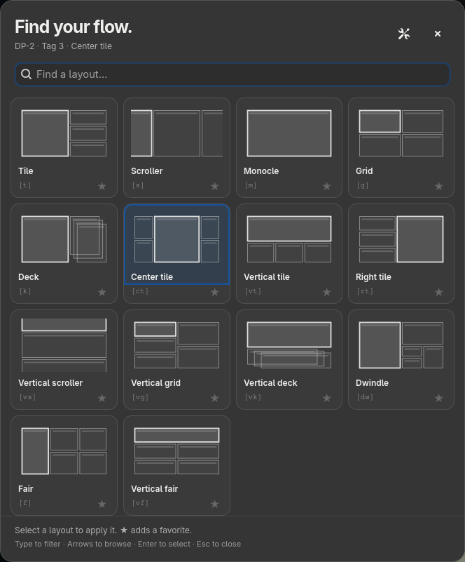

# Mango Layout Tray

Pick a MangoWM layout without remembering its name or binding. Click the tray
indicator, choose a wireframe preview, and get back to your windows.

The indicator uses large capitals, such as `T` or `CT`, with the bracketed
abbreviation in its tooltip. It follows
changes made through keyboard shortcuts. The picker targets the monitor where
you invoked it. It supports all 14 MangoWM layouts, search, favorites, a compact
view, and a taller drawer. Colors come from your GTK theme; light and dark
options are available in Settings.



[Drawer preview](docs/screenshots/drawer.png) · [Light mode](docs/screenshots/light.png)

## Install

You need MangoWM with the JSON socket IPC used by `mmsg get all-monitors`, a
Wayland session, GTK4 4.8 or newer, and a panel that hosts standard
StatusNotifierItem tray applications. `MANGO_INSTANCE_SIGNATURE` must be present
in the app's environment. A tray host is optional when using `--show` directly.

[GitHub releases](https://github.com/mikkelrask/mango-layout-tray/releases)
contain x86_64 Linux archives, Debian packages, RPM packages, and SHA256 checksums.
These builds target glibc 2.39 or newer, including Ubuntu 24.04 and recent Fedora
and Arch systems. The archive and packages include gtk4-layer-shell; GTK4 itself
comes from your distribution. Build from source for other architectures or older
glibc systems.

### Arch

Install the prebuilt release from
[AUR](https://aur.archlinux.org/packages/mango-layout-tray-bin):

```sh
yay -S mango-layout-tray-bin
```

Or build the included source package after the matching version tag has been published:

```sh
mkdir mango-layout-tray-package
cp packaging/PKGBUILD mango-layout-tray-package/
cd mango-layout-tray-package
makepkg -si
```

The included `packaging/PKGBUILD` builds from source. The AUR package uses the
GitHub release archive and does not need Rust.

### Ubuntu and Debian

Download the `.deb` release asset and install it:

```sh
sudo apt install ./mango-layout-tray-*_amd64.deb
```

The prebuilt package requires glibc 2.39 or newer. For a source build on Ubuntu
24.04, install `build-essential`, `pkg-config`, and `libgtk-4-dev`, then build
[gtk4-layer-shell](https://github.com/wmww/gtk4-layer-shell#building) if your
repositories do not provide `libgtk4-layer-shell-dev`. The GTK3 package
`libgtk-layer-shell-dev` is a different library.

### Fedora

Download the `.rpm` release asset:

```sh
sudo dnf install ./mango-layout-tray-*.rpm
```

For source builds, install `gcc`, `pkgconf-pkg-config`, `gtk4-devel`, and
`gtk4-layer-shell-devel`.

### From source

Install Rust 1.92 or newer, GTK4 development files, and gtk4-layer-shell development
files. On Arch:

```sh
sudo pacman -S rust base-devel gtk4 gtk4-layer-shell
cargo build --release --locked
sudo make install PREFIX=/usr/local
```

`make install` adds the binary, desktop entry, icon, and license. It does not
turn on autostart. `sudo make uninstall PREFIX=/usr/local` removes those files.

The Linux archive has `bin`, `lib`, and `share` directories. Extract it into a
single prefix, such as `~/.local`, and add that prefix's `bin` to your `PATH`.
Keep `lib/mango-layout-tray` next to `bin`: the binary uses that relative path to
find its bundled layer-shell library.

## Use

```sh
mango-layout-tray             # Run quietly in the tray
mango-layout-tray --show      # Open on the focused monitor, or start and open
mango-layout-tray --settings  # Open Settings
mango-layout-tray --check     # Check configuration and Mango IPC; no UI
mango-layout-tray --quit      # Stop the running instance
```

A left click opens the picker on the monitor under the pointer. Right click
opens the standard tray menu, including quick layout selection. Running the
command again reuses the existing instance.

Type to filter, use arrow keys to browse, and press Enter to apply. Escape or a
click outside closes the picker. `Ctrl+,` opens Settings. Star layouts to bring
them to the front; Settings also lets you change their order and switch between
compact and drawer views. Mode and order changes take effect next time you open
the picker.

Selection changes the active tags captured when you opened the picker. If you
change tags while it is open, reopen it before choosing a layout. If monitor
focus has moved elsewhere, the app briefly focuses the invoked monitor to apply
the layout, then restores the previous monitor focus.

For a Mango keybinding:

```ini
bind=SUPER,l,spawn,mango-layout-tray --show
```

## Start with Mango

Add this to your Mango configuration:

```ini
exec-once=mango-layout-tray
```

Or enable “Start with the session” in Settings. The toggle adds a marked
`exec-once` block to your Mango configuration, using the installed binary’s full
path. It takes effect next session and needs no XDG autostart runner. Disabling
it removes only that block. Existing startup commands are left alone. Use either
the manual entry or the toggle. Startup is opt-in.

The app uses the running compositor’s `-c` path when available, otherwise
`~/.config/mango/config.conf`, matching Mango’s own default path.
It preserves a backup before its first edit and follows configuration symlinks.
Older XDG autostart entries are removed when you change the toggle; users
upgrading from 0.1.1 should enable it again.

If the app starts through a session service, make sure the service receives
`WAYLAND_DISPLAY`, `DBUS_SESSION_BUS_ADDRESS`, and `MANGO_INSTANCE_SIGNATURE`.
Starting it from Mango's `exec-once` avoids that environment mismatch.

## Layer blur and shadows

If the picker has a blurred rectangle around it, Mango may be applying layer
blur or shadows to its transparent overlay. The picker draws its own opaque
panel and soft shadow; disable compositor effects for this layer only:

```ini
layerrule=noblur:1,noshadow:1,layer_name:^mango-layout-tray$
```

Add the rule to your Mango configuration, reload it, and reopen the picker.
Other applications keep their existing blur and shadow settings. The same rule
covers the drawer and Settings overlay.

## Configuration

Settings are saved atomically to
`$XDG_CONFIG_HOME/mango-layout-tray/config.toml`, or
`~/.config/mango-layout-tray/config.toml` when the variable is unset:

```toml
drawer = false
theme = "system" # "system", "light", or "dark"
favorites = ["tile", "center_tile"]
order = ["tile", "center_tile", "scroller"]
```

Unlisted layouts remain available. Favorites come first, then the specified
order, then the remaining layouts. Unknown names and misspelled setting keys
produce an error instead of silently changing your preferences.

## Development and releases

```sh
make check
cargo run -- --show
```

`scripts/live-smoke.py` exercises all 14 layouts against a live Mango session,
checks tray updates, search, favorites, ordering, autostart, and drawer mode,
then restores the original layout. Quit the app first. It uses Python 3.11 or
newer with PyGObject and the AT-SPI typelib, plus `mmsg` and `busctl`:

```sh
python3 scripts/live-smoke.py target/release/mango-layout-tray
WTYPE=/usr/bin/wtype python3 scripts/live-smoke.py # Also test keyboard input
```

The unit tests cover IPC responses, changed tags, monitor targeting, and focus
restoration after both successful and failed selections. Multi-monitor behavior
has mock coverage; the live test machine currently has one monitor.

The app connects directly to Mango's Unix socket using the same newline-delimited
JSON protocol as `mmsg`. The tray registers when a host becomes available, including after a panel restart.
State changes arrive through `watch all-monitors`; it
does not poll or spawn commands while idle. Disconnects trigger a reconnect
attempt every three seconds.

The UI uses Rust, GTK4, and gtk4-layer-shell. GPUI was evaluated, but its current
Wayland backend does not provide layer-shell surfaces. GTK keeps the picker out
of the tiled layout and lets it follow native theme colors.

GitHub Actions checks formatting, Clippy, tests, and release compilation on
pushes to `main` and pull requests. It also builds an archive, `.deb`, and `.rpm`.
To publish, update the version in `Cargo.toml`, `Cargo.lock`, and
`packaging/PKGBUILD`, then push a matching version tag:

```sh
git tag v0.1.0
git push origin v0.1.0
```

The release job runs only after the checks pass. No separate production branch
is needed. CI builds on Ubuntu 24.04; live UI verification currently runs on
Arch with MangoWM. Fedora and Ubuntu desktop testing is still needed.

MIT licensed. Layout names and behavior follow the
[MangoWM layout documentation](https://mangowm.github.io/docs/window-management/layouts/).
